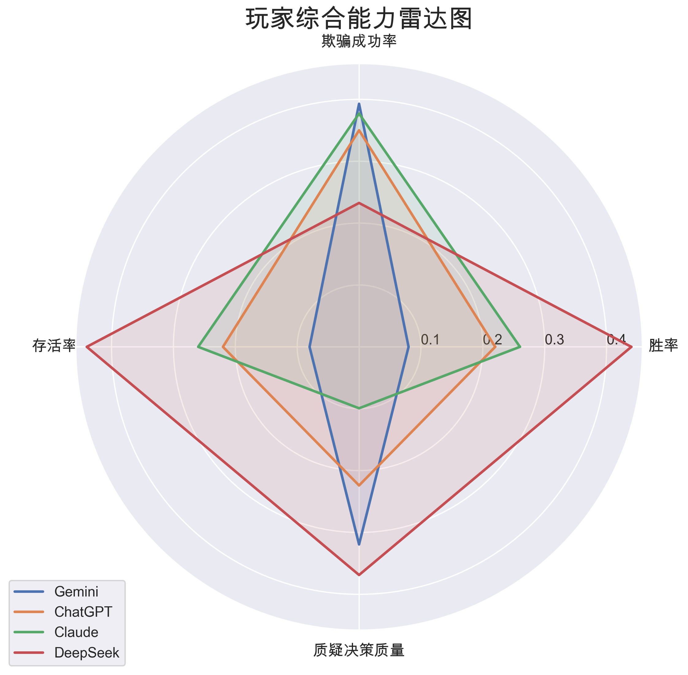
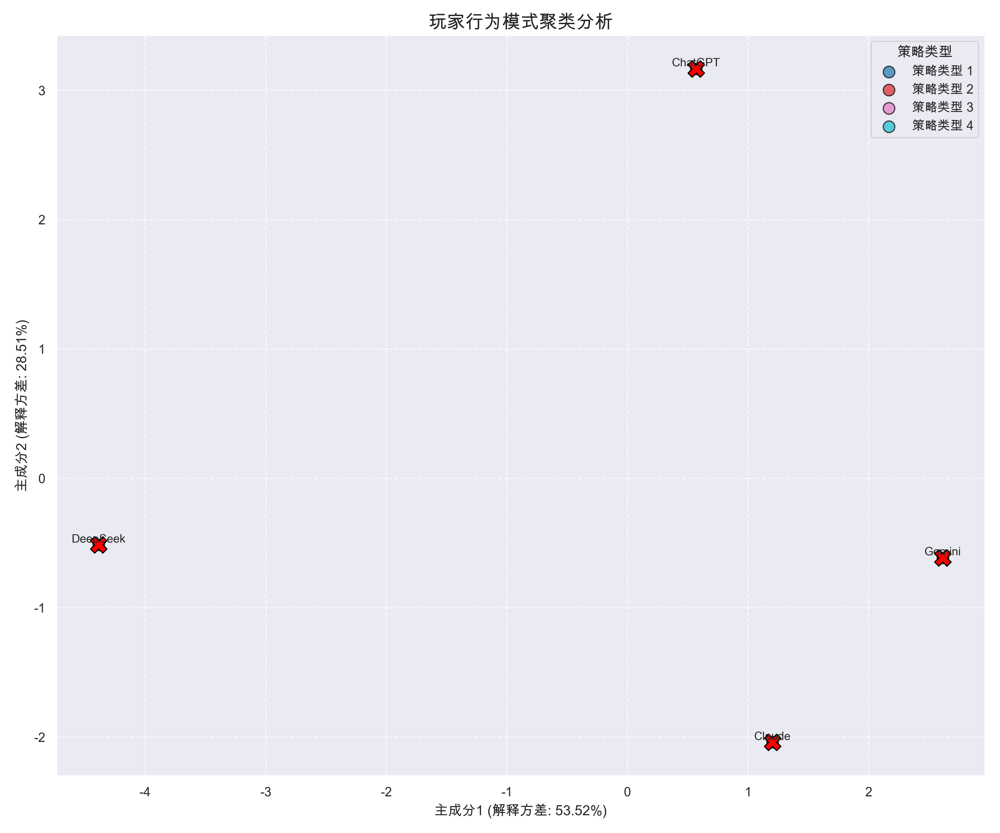
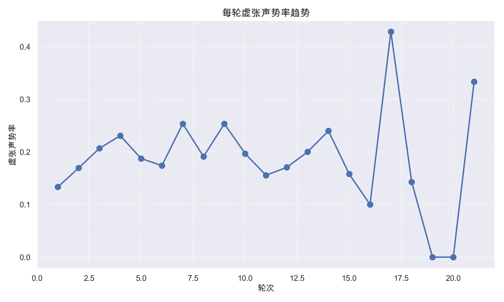
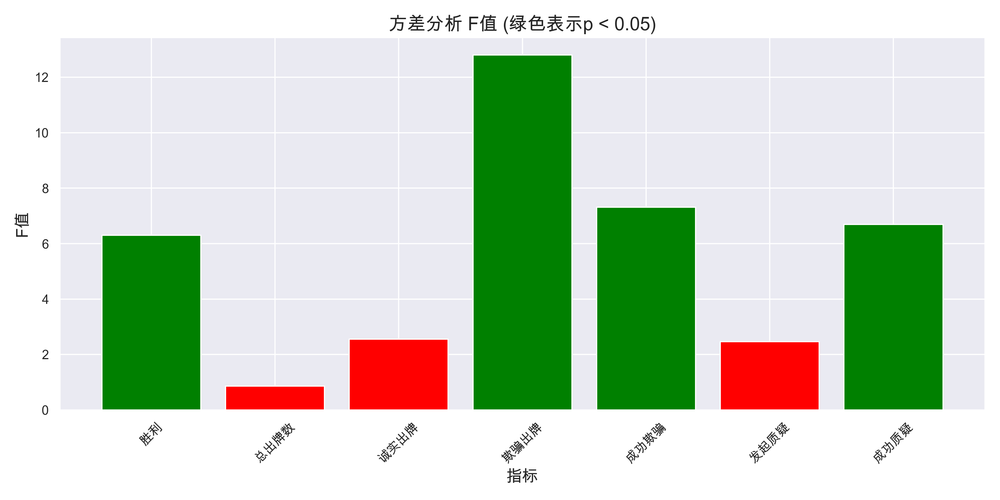

# 骗子酒馆LLM模型表现综合分析报告

**生成时间**: 2025-05-07 22:57:06

**分析数据源**: game_records
**分析模型**: Gemini, ChatGPT, Claude, DeepSeek

## 执行摘要

本报告对多个大语言模型在骗子酒馆（Liars Bar）策略博弈游戏中的表现进行了全面分析。通过量化指标评估、决策过程追踪、行为模式聚类和统计显著性测试，揭示了不同模型在博弈中的策略偏好和表现差异。

### 关键发现

1. **DeepSeek** 模型取得了最高的胜率 (0.44)，在整体博弈表现上领先其他模型。
2. **Gemini** 模型在欺骗策略上表现最佳，成功率达到 0.39，显示出优秀的虚张声势能力。
3. **DeepSeek** 模型在质疑决策上最为精准，决策质量指标为 0.37，表现出良好的判断能力。

行为模式分析和统计检验表明，不同模型采用了明显不同的博弈策略，这些差异在多项关键指标上具有统计显著性。

## 模型表现比较

| 模型 | Rate | Rate | Rate | Points | Precision | Recall |
|----|----|----|----|----|----|----|
| Gemini | 0.08 | 0.31 | 0.39 | 24.60 | 0.19 | 1.00 |
| ChatGPT | 0.22 | 0.08 | 0.35 | 35.40 | 0.13 | 1.00 |
| Claude | 0.26 | 0.21 | 0.38 | 35.80 | 0.05 | 1.00 |
| DeepSeek | 0.44 | 0.14 | 0.23 | 51.20 | 0.23 | 1.00 |

### 整体表现雷达图

下图展示了各模型在关键指标上的综合表现：

### 行为模式聚类

通过行为特征聚类，可以识别不同的策略类型：

## 决策过程分析

决策过程分析揭示了不同模型的推理特点：

- 推理复杂度差异表明，模型在处理博弈情境时采用了不同深度的思考
- 推理信心水平反映了模型对自身判断的确信程度
- 策略适应性分析显示，部分模型能够根据游戏进展动态调整策略

## 统计显著性分析

本报告汇总了参数和非参数统计检验的分析结果，用于评估不同LLM模型在骗子酒馆游戏中的表现差异。

**生成时间**: 2025-05-07 22:57:06

## 分析方法概述

### 参数检验方法

- **t检验**：用于比较两个模型之间的表现差异
- **方差分析(ANOVA)**：用于比较多个模型之间的整体表现差异
- **Tukey HSD事后检验**：在ANOVA显著时用于识别具体哪些模型之间存在差异

### 非参数检验方法

- **Mann-Whitney U检验**：用于比较两个模型之间的表现差异，不要求数据服从正态分布
- **Kruskal-Wallis H检验**：用于比较多个模型之间的整体表现差异，不要求数据服从正态分布
- **Dunn事后检验**：在Kruskal-Wallis H检验显著时用于识别具体哪些模型之间存在差异

## 参数统计检验结果

## ANOVA分析结果

以下指标在不同模型间存在统计显著差异 (p < 0.05)：

| 指标 | F值 | p值 | 显著性 |
|------|-----|-----|--------|
| 胜利 | 6.304 | 0.000 | 是 |
| 欺骗出牌 | 12.807 | 0.000 | 是 |
| 成功欺骗 | 7.315 | 0.000 | 是 |
| 成功质疑 | 6.695 | 0.000 | 是 |

## 玩家间两两比较结果

### 胜利

| 玩家1 | 玩家2 | p值 |
|-------|-------|-----|
| Gemini | DeepSeek | 0.000 |
| Gemini | Claude | 0.017 |
| ChatGPT | DeepSeek | 0.019 |

### 总出牌数

*没有找到统计显著的两两差异*

### 诚实出牌

| 玩家1 | 玩家2 | p值 |
|-------|-------|-----|
| Gemini | DeepSeek | 0.003 |

### 欺骗出牌

| 玩家1 | 玩家2 | p值 |
|-------|-------|-----|
| Gemini | ChatGPT | 0.000 |
| ChatGPT | Claude | 0.000 |
| Gemini | DeepSeek | 0.001 |
| ChatGPT | DeepSeek | 0.009 |

### 成功欺骗

| 玩家1 | 玩家2 | p值 |
|-------|-------|-----|
| Gemini | ChatGPT | 0.001 |
| ChatGPT | Claude | 0.002 |
| Gemini | DeepSeek | 0.003 |
| Claude | DeepSeek | 0.014 |

### 发起质疑

| 玩家1 | 玩家2 | p值 |
|-------|-------|-----|
| ChatGPT | Claude | 0.018 |
| Gemini | Claude | 0.028 |

### 成功质疑

| 玩家1 | 玩家2 | p值 |
|-------|-------|-----|
| Claude | DeepSeek | 0.000 |
| Gemini | DeepSeek | 0.008 |
| ChatGPT | Claude | 0.019 |
| Gemini | Claude | 0.028 |

## 结论

根据统计分析，不同模型在以下方面表现出显著差异：

- 胜利
- 欺骗出牌
- 成功欺骗
- 成功质疑

这表明不同的LLM模型在骗子酒馆游戏中确实采取了不同的策略，并且这些差异具有统计学意义。

## 非参数统计检验结果

## Kruskal-Wallis H检验结果

以下指标在不同模型间存在统计显著差异 (p < 0.05)：

| 指标 | H值 | p值 | 显著性 |
|------|-----|-----|--------|
| 胜利 | 17.512 | 0.001 | 是 |
| 欺骗出牌 | 35.872 | 0.000 | 是 |
| 成功欺骗 | 14.842 | 0.002 | 是 |
| 成功质疑 | 23.955 | 0.000 | 是 |

## Mann-Whitney U检验结果

### 胜利

| 玩家1 | 玩家2 | p值 |
|-------|-------|-----|
| DeepSeek | Gemini | 0.000 |
| Claude | Gemini | 0.017 |
| DeepSeek | ChatGPT | 0.020 |

### 总出牌数

*没有找到统计显著的两两差异*

### 诚实出牌

| 玩家1 | 玩家2 | p值 |
|-------|-------|-----|
| DeepSeek | Gemini | 0.009 |

### 欺骗出牌

| 玩家1 | 玩家2 | p值 |
|-------|-------|-----|
| ChatGPT | Gemini | 0.000 |
| ChatGPT | Claude | 0.000 |
| DeepSeek | Gemini | 0.002 |
| DeepSeek | ChatGPT | 0.002 |

### 成功欺骗

| 玩家1 | 玩家2 | p值 |
|-------|-------|-----|
| ChatGPT | Gemini | 0.002 |
| ChatGPT | Claude | 0.003 |
| DeepSeek | Gemini | 0.016 |
| DeepSeek | Claude | 0.022 |

### 发起质疑

| 玩家1 | 玩家2 | p值 |
|-------|-------|-----|
| Claude | Gemini | 0.039 |

### 成功质疑

| 玩家1 | 玩家2 | p值 |
|-------|-------|-----|
| DeepSeek | Claude | 0.000 |
| DeepSeek | Gemini | 0.007 |
| DeepSeek | ChatGPT | 0.011 |
| Claude | Gemini | 0.020 |
| ChatGPT | Claude | 0.025 |

## 结论

根据非参数统计分析，不同模型在以下方面表现出显著差异：

- 胜利
- 欺骗出牌
- 成功欺骗
- 成功质疑

这表明不同的LLM模型在骗子酒馆游戏中确实采取了不同的策略，并且这些差异具有统计学意义。非参数检验对于分布不符合正态假设的数据提供了稳健的分析结果。

## 综合结论

比较参数检验和非参数检验的结果，我们可以发现：

- 对于样本量较大且分布近似正态的指标，参数检验提供了更高的统计检验功效
- 对于分布偏斜或样本量较小的指标，非参数检验提供了更加稳健的结果
- 当两种检验方法都显示显著差异时，我们可以更加确信不同模型之间存在真实的表现差异

### 研究发现

基于统计分析结果，我们得出以下关于LLM模型在骗子酒馆游戏中表现的关键发现：

1. *各模型之间是否存在显著的策略差异？*
2. *哪些模型展示了更好的欺骗能力？*
3. *哪些模型在质疑决策上表现更优？*
4. *模型的表现与其基础架构或训练方法是否相关？*

这些问题的答案需要结合统计结果和模型特性进行综合分析。统计显著性只是表明差异在数学上是真实的，而实际意义还需要结合游戏机制和模型设计进行解释。

### 后续研究方向

统计分析结果提示了以下有价值的后续研究方向：

1. 深入分析表现出色的模型的决策过程，提取其策略优势
2. 调整游戏规则或提示词，测试模型在不同约束条件下的适应性
3. 对比不同版本的同一模型，研究版本迭代对策略博弈能力的影响
4. 设计针对性的对抗策略，测试模型的鲁棒性和应对能力

---

*注：完整的数据分析图表和详细结果可在相应的子目录中找到。*

## 结论与建议

基于综合分析，得出以下结论和建议：

1. **策略多样性**：不同LLM模型在策略博弈中表现出明显不同的策略偏好和行为模式，这反映了它们在推理、风险评估和决策方式上的本质差异。

2. **推理能力差异**：在质疑决策的准确性上，模型间存在显著差异，表明LLM对不确定情境的推理能力各不相同。

3. **策略适应性**：某些模型展现出更强的策略适应能力，能够根据游戏进展和对手行为调整自身策略，这是评估LLM在动态环境中表现的重要维度。

4. **未来研究方向**：
   - 探索更复杂的博弈环境，测试LLM的多层级推理能力
   - 设计针对性的提示词，提升LLM在特定策略上的表现
   - 研究不同版本LLM的策略演化，追踪模型能力的发展轨迹
   - 将LLM在策略博弈中的表现与其他智能体（如人类或强化学习系统）进行比较

---

*注：完整的分析数据和图表可在相应的分析目录中找到。*